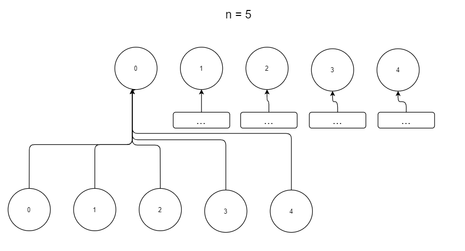
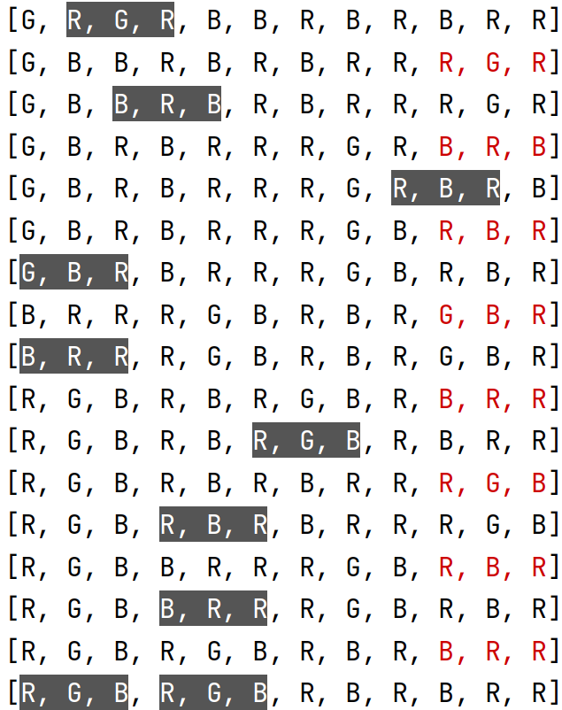

# RGBSortingAlgorithmicProblem

## Table of contents
* [About](#about)
* [Algorithms implemented](#algorithms-implemented)
* [Runtime example](#runtime-example)
* [How to generate a vector of RGB elements](#how-to-generate-a-vector-of-rgb-elements)
* [How to print RGB elements](#how-to-print-rgb-elements)
* [How to build an algorithm for the RGB problem](#how-to-build-an-algorithm-for-the-rgb-problem)
* [How to use the algorithms](#how-to-use-the-algorithms)


## About

Project made for subject Algorithm Analysis on the Warsaw University of Technology.

Task description:

On the ramp there are three-colored balls arranged in a random order: red, green and blue. They should be arranged with a crane in such a way that they are arranged as RGB triangles. If the colors are not different, the "excess" spheres may remain unsorted. In one movement, the crane can lift three adjacent balls from any place on the ramp up simultaneously and carry them to the end, behind the balls lying above, which will roll down under their own weight, filling the gap. Make a plan for the crane's work, dictating which three balls to move to the end. Make as few moves as possible.

## Algorithms implemented

**NaiveSorting**

First we have a problem where there must be a letter x under the index [0] (we start with x = R).
We try to search for x in 3k places, if we find it then we just move the first three to the end so it starts with x.
If there is not the desired value in those places, then we look for the index of the first x encountered (iterating
from bottom to top) and try put it to the beginning. Depending on the number of balls, there are 3 cases:
- size (input) == 3n ⇒ take the three of the x at the beginning [x,?,?] and put it at the end and keep moving all the
first three at the end until x stops at the beginning.
- size (input) == 3n + 1 ⇒ take the triple of x at the end [?,?,x] and move it to the end. Then again, taking all
three of them out of the beginning, x at some point will stand in the desired place.
- size (input) == 3n + 2 ⇒ you have to take the three of x so that x stands in 2nd place [?,x,?] And take the first
three.
  
**BreadthSearch**

Create root nodes with values from 0 to kChildNodesNumber exclusively which represent
the indexes of groups of elements which will be moved to the end of the elements sequence.
For each root node check if after moving groups of elements we get the correct solution. If not then
for each root node create child nodes and call the recursiveSolution with all the child nodes.



**InitialTripleSearch**

Note: The algorithm works only when the number of balls is divisible by 3.
Phase 1: Take all RGB triples and put them last. The ramp will consist of a set of unsorted [N] circles at the bottom + sorted [S] at the top.
Phase 2: We wisely move the balls from the N set to the top. You can extract the first triple from the set N, which is of the form [R, G, x], if there is no such, then extract [R, x, x] and move the selected triple to the end of the ramp. Then we take the next best three from the set N again and carry it to the end. To select the next best group, we look at the last color at the top of the ramp and try to find a three that starts with the next color. So if the last ball is R, then it is better to choose [G, B, R], worse [G, B, x] and the least priority three is [G, x, x]. Phases 1. and 2. are repeated until the number of iterations without arranging at least one new RGB triple exceeds the limit specified as the argument of calling the method.
Phase 3: After exceeding the limit of failed attempts on the unsorted part, the NaiveSorting algorithm is run.

**AdvancedSort**

Note: The algorithm works only when the number of balls is divisible by 3.
First, the crane looks for triplets arranged in an RGB sequence on the ramp and transfers them to the end. After shifting all such triples, it looks for triples made of RGx, where x = R / G, and looks for a triple consisting of xxB for it. He transfers both three to the end, giving him a string of RGxxxB balls. Of these three, he takes xxx and carries it to the end. Then it does the same for the Rxx and xGB triples. After exhausting all possibilities, he moves any RGB triplets he finds to the end of the ramp. Then it looks for triples consisting of Rxx, xGx and xxB and transfers them not over. From the resulting string of balls, it carries two xxx threes to the end.


## Runtime example

```txt
./RGB_algorithmic_problem.exe
---
Use 'help' to see the list of commands
Enter your command: help
help
exit: terminate the process
help: list all the commands
adv: sort the balls using the advanced algorithm
naive: sort the balls using the naive sorting algorithm
breadth: sort the balls using the breadth search algorithm
ini: sort the balls using the initialTripleSearch algorithm
ini2: sort the balls using the initialTripleSearch algorithm
meas: Measure time of the advanced algorithm
Enter your command: adv
adv
Enter the number of balls divisible by 3
12
```



## How to generate a vector of RGB elements

For now there implemented some distributions and 1 elements generator from the _randomUtilities.h_

```c++
std::vector<RgbElement> elements(kElementsNumber);

//  Use of the uniform distribution
std::generate(elements.begin(), elements.end(),[] {
return kRgbElements[randomUniformInteger(0, 2)];
});

//  Use of the linkedRandomIntegersGenerator
const auto generator = linkedRandomIntegersGenerator(0.5, 0, 2);
std::generate(elements.begin(), elements.end(),[&generator] {
return kRgbElements[generator()];
});
```

## How to print RGB elements

To print a vector of rgb elements or a single RgbElement use functions declared in algorithmUtilities.h

```c++
std::vector<RgbElement> elements{ R, G, B };
std::cout << elements[0] << std::endl;
std::cout << elements << std::endl;
```

## How to build an algorithm for the RGB problem

Use some code from the rgbAlgorithmUtilities.h

- **Solution** structure to represent the solution.
- **moveTripleBack()** function to move a group of 3 elements to the back of elements sequence.
- **areElementsArrangedCorrectly()** function to check if elements are arranged correctly.
- **maxRgbGroupsAmount()** function that calculates the maximum amount of groups containing 3 RgbElements that can be
  found in the elements vector.

## How to use the algorithms

- There is a **BreadSearch** class which has a static **solution()** method which gives the Solution
  instance.
  
- There is a **AdvancedSort** class which has a static **solution()** method which gives the Solution
    instance.
    
- There is a **InitialTripleSearch** class which has a static **sort()** method which gives the Solution
      instance.
      
- There is a **BreadSearchAlgorithm** class which has a static **sort()** method which gives the Solution
        instance.
